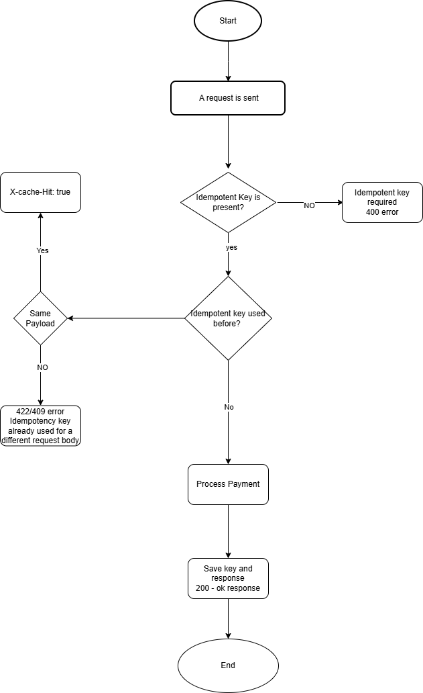

# Idempotency Gateway (The Pay-Once Protocol)
This is a middleware sevice which ensures that payment is process exactly once no matter how many times a client sends the same request.

## Architeture Diagram
